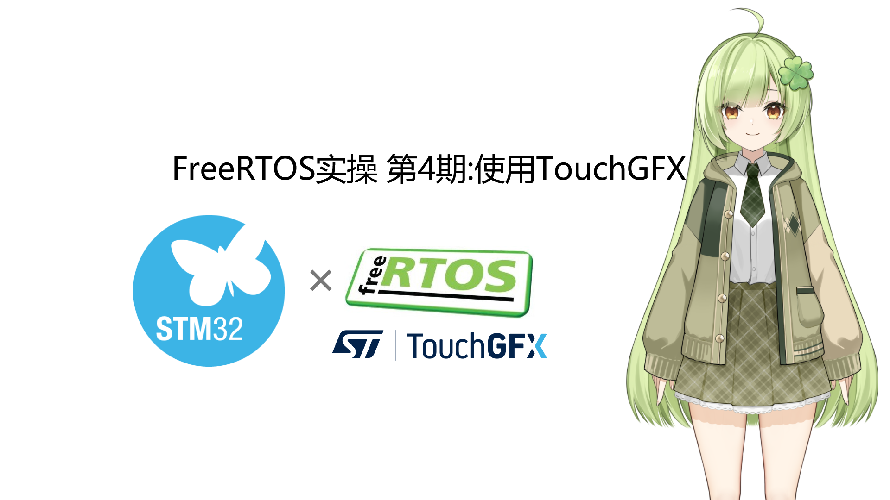
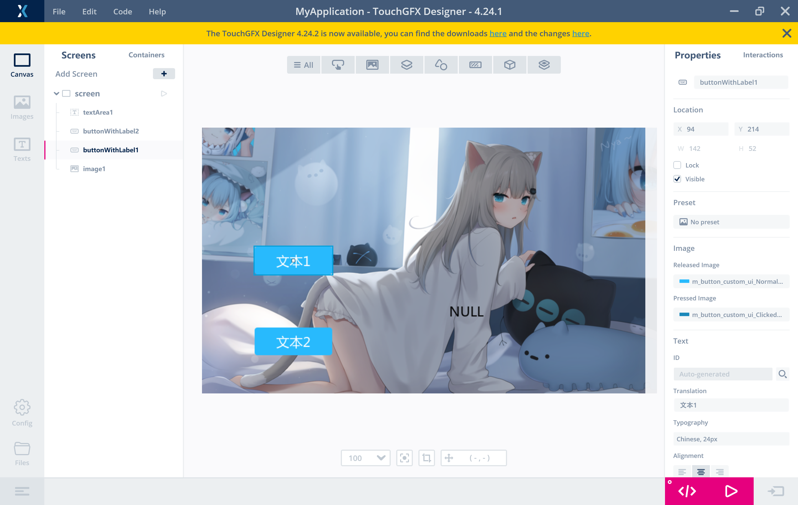

# FreeRTOS_TouchGFX
 项目简介：通过FreeRTOS，在H743上面运行TouchGFX界面库，并且使用了部分MVP(Model-View-Persener)功能。  

 **注意:TouchGFX偏向于以空间换时间，如果界面过大建议刷到外部NOR Flash运行**

 如果在重新生成硬件代码后不显示界面，请检查**freertos.c**中这任意的两个函数是否在任务代码中执行
    `
    MX_TouchGFX_Process();
	TouchGFX_Task(NULL);
    `
************

 项目封面
 

 设计器界面
 

 实机运行视频
   
